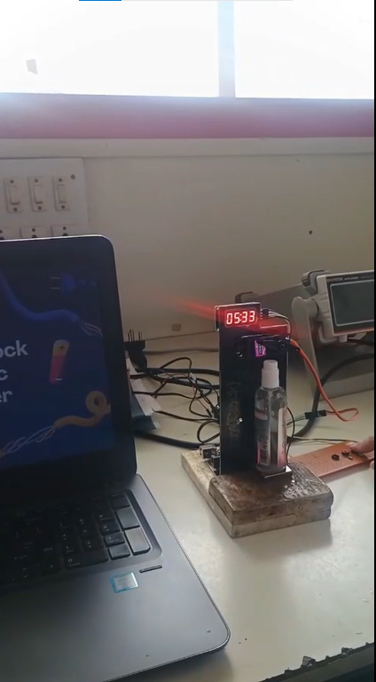

# 🕒 Digital Clock & Automatic Room Freshener

An Arduino-based embedded systems project that combines a **12-hour digital clock** with an **automatic room freshener**. The system displays the current time on a TM1637 4-digit display while controlling a servo motor to spray room freshener automatically at regular intervals.

---

## ✨ Features

- 🕒 12-Hour Digital Clock
- ⏰ Manual Hour & Minute Adjustment
- 🌸 Automatic Room Freshener
- ⚙️ Servo Motor Controlled Spray
- 💡 TM1637 4-Digit Display
- 🔄 Non-blocking Timing using `millis()`

---

## 🛠 Components Used

| Component | Quantity |
|-----------|----------|
| Arduino Uno | 1 |
| TM1637 Display | 1 |
| Servo Motor (SG90) | 1 |
| Push Buttons | 2 |
| Breadboard | 1 |
| Jumper Wires | As required |

---

## 🔌 Pin Connections

| Arduino Uno | Component |
|--------------|-----------|
| D2 | TM1637 CLK |
| D3 | TM1637 DIO |
| D5 | Servo Signal |
| D6 | Hour Button |
| D7 | Minute Button |
| 5V | TM1637 VCC & Servo VCC |
| GND | Common Ground |

---

## 📹 Project Demonstration

  

📹 **Full Demo Video:** [Watch Demo](media/demo.mp4)

---

## 📸 Project Gallery

  

  
---

## 🧠 How It Works

1. The TM1637 4-digit display continuously shows the current time in **12-hour format**.
2. Two push buttons allow the user to manually adjust the **hour** and **minute** values.
3. The Arduino uses the `millis()` function to update the clock every minute without blocking other tasks.
4. Every **5 seconds** (configured for demonstration purposes), the servo motor rotates to press the room freshener nozzle.
5. After spraying, the servo automatically returns to its initial position and waits for the next interval.
6. In a real-world implementation, the spray interval can be increased to **30 minutes, 1 hour, or a custom duration**.

---

## ⚡ Circuit Diagram

*(Circuit diagram will be added here.)*

---

## 📚 What I Learned

Working on this project helped me strengthen my understanding of:

- Programming in Embedded C++ using Arduino IDE
- Interfacing a TM1637 4-digit display
- Controlling a servo motor for mechanical automation
- Using the `millis()` function for non-blocking timing
- Implementing button debouncing for reliable user input
- Integrating hardware and software into a complete embedded system
- Debugging and testing embedded applications

---

## ⚠️ Challenges Faced

During the development of this project, I encountered several challenges:

- Ensuring accurate time updates while performing other tasks simultaneously.
- Preventing multiple button presses using software debouncing.
- Controlling the servo motor smoothly without affecting the clock display.
- Organizing the code to make it easy to understand and maintain.
- Testing the spray mechanism repeatedly to ensure reliable operation.

These challenges helped me improve my debugging skills and gain practical experience in embedded system development.  
---

## 🚀 Future Improvements

The following enhancements can be implemented in future versions of this project:

- ⏰ Integrate a DS3231 RTC module for accurate timekeeping.
- 🌐 Upgrade to ESP32 for Wi-Fi connectivity and remote monitoring.
- 📱 Develop a mobile application to configure spray intervals.
- ⚙️ Allow users to set custom spray timings using the push buttons.
- 🔋 Add a rechargeable battery backup for uninterrupted operation.
- 📺 Replace the TM1637 display with an OLED display to show additional information such as date and spray status.
- 🌸 Support multiple spray modes (Normal, Eco, and Intensive).

These improvements would make the project more practical for real-world use while enhancing user experience and functionality.
---
## 🎯 Key Takeaways

This project provided valuable hands-on experience in embedded systems by combining hardware interfacing, real-time timing, and automation. It strengthened my understanding of integrating multiple components into a functional system while improving my debugging, testing, and problem-solving skills.

The project also highlighted the importance of writing structured, maintainable code and designing embedded applications that can be expanded with future features.
---
